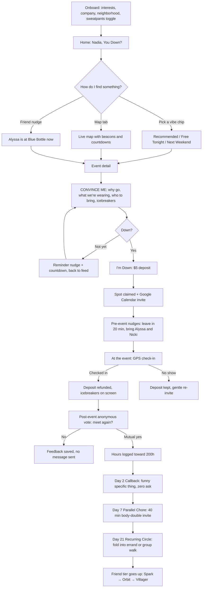
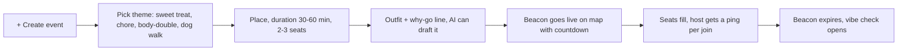

# Down: User Flow

Source: team brainstorm doc. Tagline: "You don't need plans. You just need to be down."
Legend: ✅ exists in the app today · 🟡 partly built · ⬜ in the brainstorm, not built yet

## 0. The one-line flow

Open app → **see who's down** → **get convinced** → **join + $5 deposit** → **nudges get you there** → **check in (GPS, deposit back)** → **vote** → **Day 2 / 7 / 21 follow-ups** → **hours add up to the 200-hour friend**

## 1. Main flow (attendee)

| Step | Screen | Status |
|---|---|---|
| Onboard | Interests, company, neighborhood, sweatpants toggle | ⬜ (profile edit exists, no first-run onboarding) |
| Home | Hero, vibe chips, 3 event rows | ✅ |
| Live map | Beacons with countdown | ✅ |
| Convince Me | Reason, outfit, icebreakers | ✅ |
| $5 deposit | Apple Pay style sheet | ✅ |
| Google Calendar invite | After joining | ⬜ |
| Pre-event nudges (leave in 20, bring a friend) | Push / Photon message | 🟡 (AI coach drawer only, no scheduled push) |
| GPS check-in + refund | At venue | ⬜ (copy says it, no check-in screen) |
| Vibe check vote | Post-event modal | ✅ |
| Day 2 / Day 7 / Day 21 messages | Photon message + in-app card | ⬜ |
| Friend meters, tiers, 200h | Profile | ✅ |

## 2. Host flow (drop a beacon)

Small groups only (2-3 seats). The group size follows the activity, so the reason to gather stays true. Status: ✅ create sheet exists, ⬜ host ping on join.

## 3. Nudge timeline (the "anti-lazy me" layer)

| When | Nudge | Goal |
|---|---|---|
| 1 hr before | "Blue Bottle in 1 hr, 1 seat left" | Stop talking yourself out of it |
| 20 min before | "Leave in 20 minutes and you'll still have an hour there!" | Get moving |
| At the venue | "Bring Alyssa and Nicki, they like X too" | Grow the circle |
| Any time | "You haven't followed up with Zain in 2 weeks, invite them for coffee" | Keep weak ties alive |
| Right after | Vote: do you want to meet again? | Consent before follow-up |
| Day 2 | Callback message, zero ask | Validate the connection |
| Day 7 | Parallel chore invite | Cheap second hang |
| Day 21 | Recurring circle | Hit the 200-hour path |

## 4. Edge cases the brainstorm doesn't cover (need a decision)

1. **Event full**: waitlist, or "start your own beacon"?
2. **Host cancels**: is everyone's deposit refunded automatically?
3. **Bad GPS or late arrival**: how many minutes of grace before the deposit is kept?
4. **One-sided yes on the vote**: we suggest nothing is shown to the other person.
5. **Safety**: strangers meeting up, so verified profile, block/report, and a public-place default.
6. **Deposit rule**: the doc says "meet twice and get refund" but the app says "refund on GPS check-in". Pick one.

## 5. Suggested build order

1. GPS check-in screen + deposit refund
2. Day 2 / 7 / 21 follow-up cards (in-app first, Photon later)
3. Pre-event nudges and Google Calendar invite
4. Onboarding
5. Safety and edge cases
